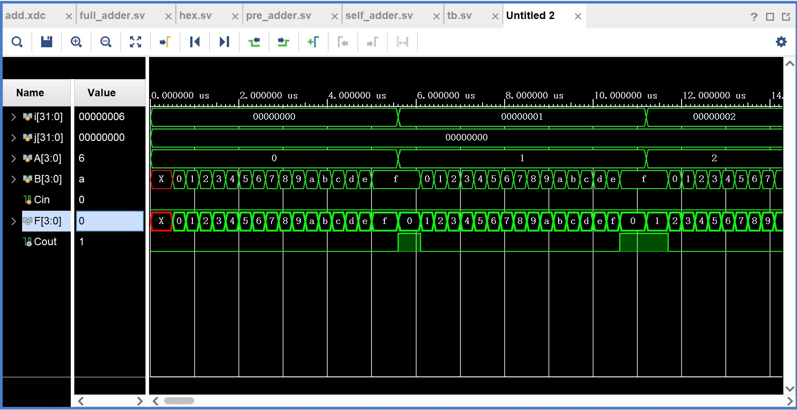
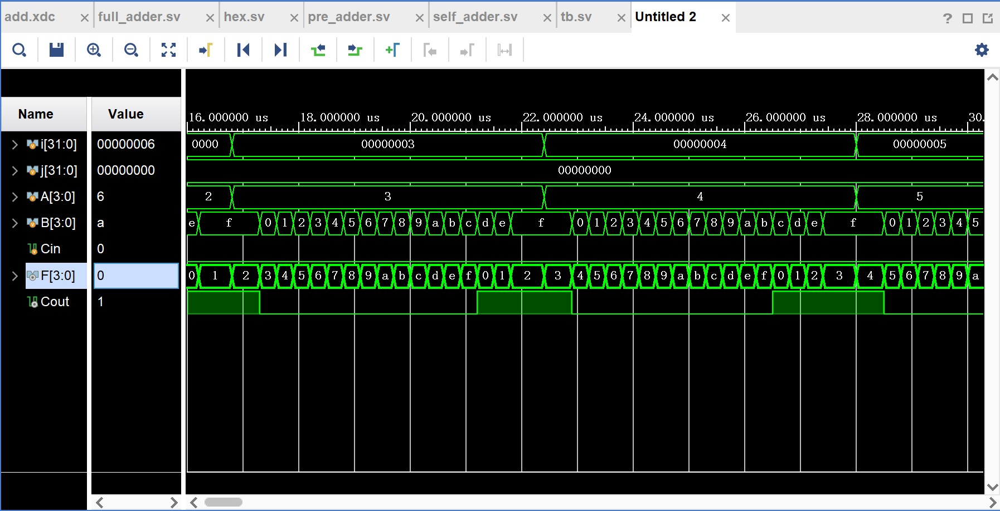
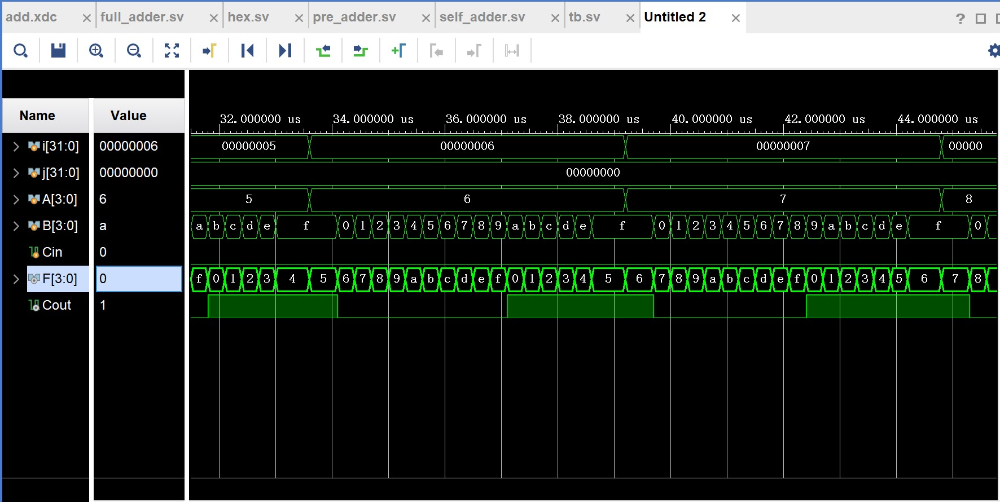
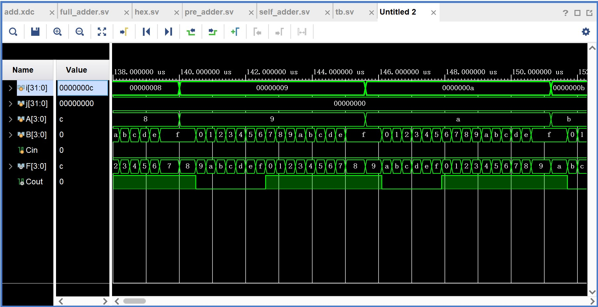
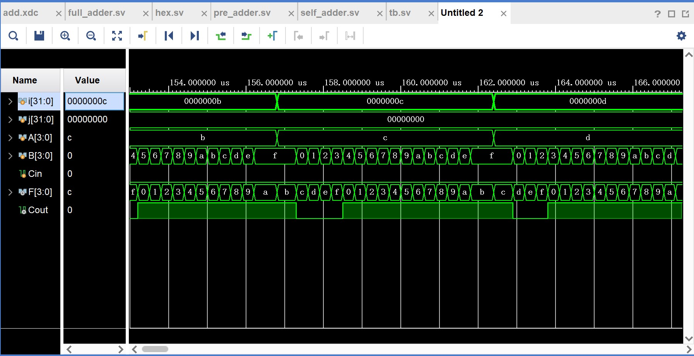
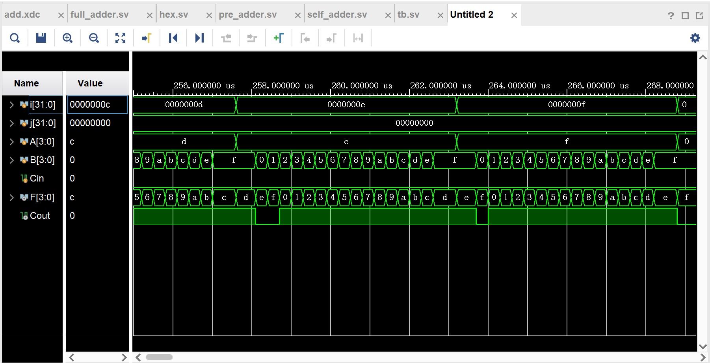
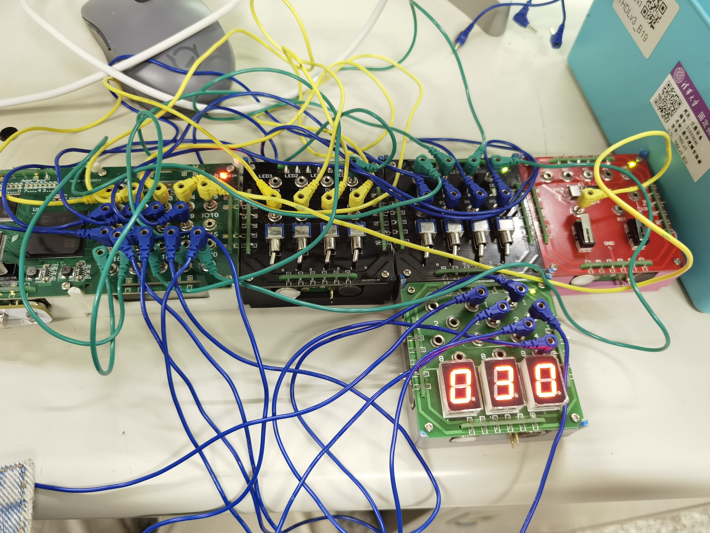
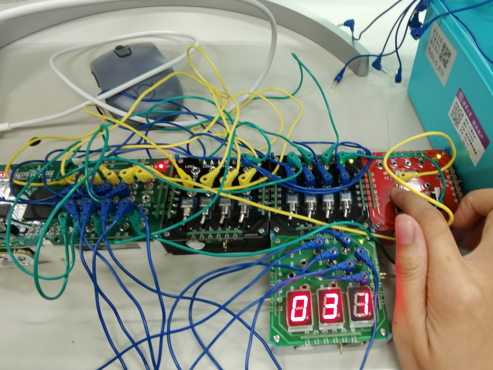

# 四位全加器实验

>刘雅迪
>
>2021010521
>
>计26

## 四位全加器

```sv
//一位全加器模块
module full_adder(A, B , Cin, F, Cout);
    input wire A, B, Cin;
    output wire F, Cout;

    assign F = A ^ B ^ Cin;
    assign Cout = (A & B) | (Cin & (A ^ B));
endmodule

//四位全加器模块
module Adder (
    input wire[3:0] A,
    input wire[3:0] B,
    input wire Cin,
    output wire[3:0] F,
    output wire Cout
    );

    wire[2:0] C;

    full_adder adder0 (
        .A(A[0]),
        .B(B[0]),
        .Cin(Cin),
        .F(F[0]),
        .Cout(C[0])
    );

    full_adder adder1 (
        .A(A[1]),
        .B(B[1]),
        .Cin(C[0]),
        .F(F[1]),
        .Cout(C[1])
    );

    full_adder adder2 (
        .A(A[2]),
        .B(B[2]),
        .Cin(C[1]),
        .F(F[2]),
        .Cout(C[2])
    );

    full_adder adder3 (
        .A(A[3]),
        .B(B[3]),
        .Cin(C[2]),
        .F(F[3]),
        .Cout(Cout)
    );

endmodule
```


## 超前四位加法器

```sv
//一位超前进位加法器
module pre_1_adder(A, B , Cin, F, Gi, Pi);
    input wire A, B, Cin;
    output wire F, Gi, Pi;
    assign Gi = A & B;
    assign Pi = A | B;
    assign F = A ^ B ^ Cin;
endmodule

//四位超前进位
module CLA_4(P,G,cin,Ci,Gm,Pm);
        input wire [3:0] P;
        input wire [3:0] G;
        input wire cin;
        output wire [4:1] Ci;
        output wire Gm;
        output wire Pm;
    assign Ci[1]=G[0]|P[0]&cin;
    assign Ci[2]=G[1]|P[1]&G[0]|P[1]&P[0]&cin;
    assign Ci[3]=G[2]|P[2]&G[1]|P[2]&P[1]&G[0]|P[2]&P[1]&P[0]&cin;
    assign Ci[4]=G[3]|P[3]&G[2]|P[3]&P[2]&G[1]|P[3]&P[2]&P[1]&G[0]|P[3]&P
    [2]&P[1]&P[0]&cin;
    assign Gm=G[3]|P[3]&G[2]|P[3]&P[2]&G[1]|P[3]&P[2]&P[1]&G[0];
    assign Pm=P[3]&P[2]&P[1]&P[0];
endmodule

module pre_4_adder(
    input wire [3:0] A,
    input wire [3:0] B,
    input wire Cin,
    output wire [3:0] F,
    output Cout //进位输出
    );
    wire Pm; //每四位的进位输出
    wire Gm; //每四位的进位传送输出
    wire [4:1] CI; //每位的进位信号
    wire [3:0] Pi; //每位的进位函数
    wire [3:0] Gi; //每位的进位传送函数
pre_1_adder u0(
    .A(A[0]),
    .B(B[0]),
    .Cin(Cin),
    .F(F[0]),
    .Gi(Gi[0]),
    .Pi(Pi[0])
);
pre_1_adder u1(
    .A(A[1]),
    .B(B[1]),
    .Cin(CI[1]),
    .F(F[1]),
    .Gi(Gi[1]),
    .Pi(Pi[1])
);
pre_1_adder u2(
    .A(A[2]),
    .B(B[2]),
    .Cin(CI[2]),
    .F(F[2]),
    .Gi(Gi[2]),
    .Pi(Pi[2])
);
pre_1_adder u3(
    .A(A[3]),
    .B(B[3]),
    .Cin(CI[3]),
    .F(F[3]),
    .Gi(Gi[3]),
    .Pi(Pi[3])
);
CLA_4 uut
(
    .P(Pi),
    .G(Gi),
    .cin(Cin),
    .Ci(CI),
    .Gm(Gm),
    .Pm(Pm)
);
	assign Cout = CI[4];
endmodule
```


## 使用SystemVerilog自带的加法运算

```sv
module FourBitAdder (
    input [3:0] A,
    input [3:0] B,
    input Cin, //进位输入
    output [3:0] F, //4位输出和
    output Cout //进位输出
);
    assign F = A + B + Cin;
    assign Cout = (A[3] & B[3]) | (A[3] & Cin) | (B[3] & Cin);
endmodule
```


## 七段数码管显示

```sv
module hex(
    input logic [3:0] A,
    input logic [3:0] B,
    input logic Cin,
    output logic [3:0] F,
    output logic Cout1, //11孔低位
    output logic Cout2 //12孔高位
);
    logic [5:0]sum;
    always_comb begin
        sum = A + B + Cin;
        if (sum < 10) begin
            F = sum;
            Cout1 = 0;
            Cout2 = 0;
        end
        else if (sum >= 10 && sum < 20) begin
            F = sum - 10;
            Cout1 = 1;
            Cout2 = 0;
        end
        else if(sum >= 20 && sum < 30)begin
            F=sum - 20;
            Cout1 = 0;
            Cout2 = 1;
        end
        else if(sum >= 30) begin
            F = sum - 30;
            Cout1 = 1;
            Cout2 = 1;
        end
	end
endmodule
```


## 约束文件

使用可编程模块上的接插孔连接开关和七段数码管，其中 IO1 ~ IO4 作为输入 `A[3:0]`，IO6 ~ IO9 作为输入 `B[3:0]`，连接到开关模块；
IO5 作为进位输入 `Cin`，连接到时钟模块；
IO17 ~ IO20 作为输出 `F[3:0]`，连接七段数码管的`a ~ f`；IO16 作为进位输出 `Cout`，连接到开关模块上的发光二极管。
具体约束文件如下：

```sv
# A input
set_property -dict {PACKAGE_PIN M21 IOSTANDARD LVCMOS33} [get_ports A[3]];     #IO1接插孔
set_property -dict {PACKAGE_PIN N20 IOSTANDARD LVCMOS33} [get_ports A[2]];     #IO2接插孔
set_property -dict {PACKAGE_PIN N22 IOSTANDARD LVCMOS33} [get_ports A[1]];     #IO3接插孔
set_property -dict {PACKAGE_PIN P21 IOSTANDARD LVCMOS33} [get_ports A[0]];     #IO4接插孔

# B input
set_property -dict {PACKAGE_PIN T21 IOSTANDARD LVCMOS33} [get_ports B[3]];     #IO6接插孔
set_property -dict {PACKAGE_PIN U21 IOSTANDARD LVCMOS33} [get_ports B[2]];     #IO7接插孔
set_property -dict {PACKAGE_PIN R21 IOSTANDARD LVCMOS33} [get_ports B[1]];     #IO8接插孔
set_property -dict {PACKAGE_PIN R22 IOSTANDARD LVCMOS33} [get_ports B[0]];     #IO9接插孔

# Cin input
set_property -dict {PACKAGE_PIN P22 IOSTANDARD LVCMOS33} [get_ports Cin];     #IO5接插孔

# F output
set_property -dict {PACKAGE_PIN AB18 IOSTANDARD LVCMOS33} [get_ports F[3]];     #IO17接插孔
set_property -dict {PACKAGE_PIN AA20 IOSTANDARD LVCMOS33} [get_ports F[2]];     #IO18接插孔
set_property -dict {PACKAGE_PIN AB21 IOSTANDARD LVCMOS33} [get_ports F[1]];     #IO19接插孔
set_property -dict {PACKAGE_PIN AA21 IOSTANDARD LVCMOS33} [get_ports F[0]];     #IO20接插孔

# Cout output
set_property -dict {PACKAGE_PIN AA18 IOSTANDARD LVCMOS33} [get_ports Cout];     #IO16接插孔

set_property CFGBVS VCCO [current_design]
set_property CONFIG_VOLTAGE 3.3 [current_design]
```

将结果转化为十进制再使用自带译码的七段数码管显示与前面相比多了两位输出来显示十进制的十位。 

用Cout1 和 Cout2 来表示十进制的十位，作为自带译码的七段数码管的十位输入，其中Cout1 为低位，Cout2 为高位。

将减去（2 * Count2 + Count1）* 10 的 F 作为个位，连接到低位的数码管输入，构成一个完整的十进制数码管显示。

 之前的 Cout 输出不再使用，将 Cout1 和 Cout2 连接到另外两个插孔。

具体约束文件如下：

```sv
# A input
set_property −dict {PACKAGE_PIN M21 IOSTANDARD LVCMOS33} [get_ports A[3]];
#IO1接 插 孔
set_property −dict {PACKAGE_PIN N20 IOSTANDARD LVCMOS33} [get_ports A[2]];
#IO2接 插 孔
set_property −dict {PACKAGE_PIN N22 IOSTANDARD LVCMOS33} [get_ports A[1]];
#IO3接 插 孔
set_property −dict {PACKAGE_PIN P21 IOSTANDARD LVCMOS33} [get_ports A[0]];
#IO4接 插 孔

# B input
set_property −dict {PACKAGE_PIN T21 IOSTANDARD LVCMOS33} [get_ports B[3]];
#IO6接 插 孔
set_property −dict {PACKAGE_PIN U21 IOSTANDARD LVCMOS33} [get_ports B[2]];
#IO7接 插 孔
set_property −dict {PACKAGE_PIN R21 IOSTANDARD LVCMOS33} [get_ports B[1]];
#IO8接 插 孔
set_property −dict {PACKAGE_PIN R22 IOSTANDARD LVCMOS33} [get_ports B[0]];
#IO9接 插 孔

# Cin input
set_property −dict {PACKAGE_PIN P22 IOSTANDARD LVCMOS33} [get_ports Cin];
#IO5接 插 孔

# F output
set_property −dict {PACKAGE_PIN AB18 IOSTANDARD LVCMOS33} [get_ports F
[3]]; #IO17接 插 孔
set_property −dict {PACKAGE_PIN AA20 IOSTANDARD LVCMOS33} [get_ports F
[2]]; #IO18接 插 孔
set_property −dict {PACKAGE_PIN AB21 IOSTANDARD LVCMOS33} [get_ports F
[1]]; #IO19接 插 孔
set_property −dict {PACKAGE_PIN AA21 IOSTANDARD LVCMOS33} [get_ports F
[0]]; #IO20接 插 孔

# Cout output
set_property −dict {PACKAGE_PIN W21 IOSTANDARD LVCMOS33} [get_ports Cout1
]; #IO11接 插 孔
set_property −dict {PACKAGE_PIN W22 IOSTANDARD LVCMOS33} [get_ports Cout2
]; #IO12接 插 孔

set_property CFGBVS VCCO [current_design]
set_property CONFIG_VOLTAGE 3.3 [current_design]
```


## 仿真

```sv
`timescale 1ns / 1ps
module tb;

integer i = 0;
integer j = 0;
reg [3:0] A;
reg [3:0] B;
reg Cin;
wire [3:0] F;
wire Cout;

initial begin
	Cin = 0;
	forever begin //连续执行，生成时钟周期等周期型波形
        A = i;
        for(int j = 0; j < 16; j ++) begin //有条件的循环语句
            B = j;
            #300;
    	end
        #300;
        i = i + 1;
        if(i >= 16) i = i − 16;
    end
end

Adder a(
    .A(A),
    .B(B),
    .Cin(Cin),
    .F(F),
    .Cout(Cout)
    );
endmodule
```













从上图的仿真结果可以看出从0到f（即15），电路的输出结果是正确的，且进位Coutd 0和1的变化也是正确的。


## 电路测试结果

我对使用十进制表示并用自带译码的七段数码管显示结果的电路进行了测试，测试结果与仿真结果一致，进位正确。当有时钟代表的进位输入时，电路也能够正确表示输出。

列了两个测试如下图：

当输入为1111（15）和1111（15）时：



当输入为1111（15）和1111（15）且有进位输入时：




## 调试中所遇到的问题及解决方法

在完成提高要求三用数码管显示十进制结果时，由于要表示十进制的十位，我将原有的一个输出改成了两个，但是却忘记了改约束文件......导致开始的时候无法生成比特流，在查看了vivado的message信息后我发现是约束出了问题，于是改了过来。