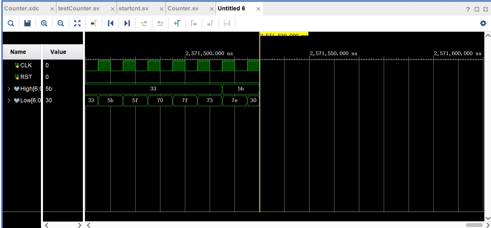

# 计数器

刘雅迪

计26

2021010521

## 00-59计数器

```
`timescale 1ns / 1ps
module counter (
    input wire CLK, 
    input wire RST, 
    output reg [6:0] High, 
    output reg [6:0] Low 
    );

    reg [3:0] cnt_H;
    reg [3:0] cnt_L;

    // posedge在时钟上升沿响应（处在敏感列表中）
    // negedge在复位按键下降沿响应
    // CLK 时钟上升沿计数一次
    // RST 复位按键下降沿可以随时复位到 00 的状态
    always_ff @(posedge CLK or posedge RST) begin
    // always过程块内部的语句会在时钟上升沿/复位按键下降沿的时候得到执行
        if(RST) begin
        // assign 语句不能在always过程块内部使用
            cnt_H <= 0; // <= 是非阻塞赋值，在整个过程块结束时才完成赋值操作，即b的值并不是立刻就改变的
            cnt_L <= 0;
        end else begin
            if (cnt_L == 9) begin
                if(cnt_H == 5) begin
                    cnt_H <= 0;
                    cnt_L <= 0;
                end else begin
                    cnt_H <= cnt_H + 1;
                    cnt_L <= 0;
                end
            end else begin
                cnt_L <= cnt_L + 1;
            end
        end
    end

    Decoder u1 (
        .d (cnt_H),
        .seg (High)
    );

    Decoder u2 (
        .d (cnt_L),
        .seg (Low)
    );
endmodule


module Decoder (
    input wire [3:0] d,    //拨动开关输入
    output reg [6:0] seg    //七段数码管输出
    );

    always_comb begin
        case (d)
            4'd0: seg = 7'b1111110;
            4'd1: seg = 7'b0110000;
            4'd2: seg = 7'b1101101;
            4'd3: seg = 7'b1111001;
            4'd4: seg = 7'b0110011;
            4'd5: seg = 7'b1011011;
            4'd6: seg = 7'b1011111;
            4'd7: seg = 7'b1110000;
            4'd8: seg = 7'b1111111;
            4'd9: seg = 7'b1110011;
            4'd10: seg = 7'b1110111;
            4'd11: seg = 7'b0011111;
            4'd12: seg = 7'b1001110;
            4'd13: seg = 7'b0111101;
            4'd14: seg = 7'b1001111;
            4'd15: seg = 7'b1000111;
            default: seg = 7'b0;
        endcase
    end
endmodule

```

## 秒表

```
`timescale 1ns / 1ps
module clock (
    input wire CLK,       // 输入1 MHz时钟
    input wire RST,       // 复位信号
    output reg [6:0] High, 
    output reg [6:0] Low 
    );

    reg [3:0] cnt_H;
    reg [3:0] cnt_L;
    wire clk_1Hz;

    // 实例化时钟分频器
    clock_divider u_clk_div (
        .clk_1MHz(CLK),
        .rst(RST),
        .clk_1Hz(clk_1Hz)
    );

    // 使用分频后的1 Hz时钟
    always_ff @(posedge clk_1Hz or posedge RST) begin
        if (RST) begin
            cnt_H <= 0;
            cnt_L <= 0;
        end else begin
            if (cnt_L == 9) begin
                if(cnt_H == 5) begin
                    cnt_H <= 0;
                    cnt_L <= 0;
                end else begin
                    cnt_H <= cnt_H + 1;
                    cnt_L <= 0;
                end
            end else begin
                cnt_L <= cnt_L + 1;
            end
        end
    end

    // 实例化七段数码管解码器
    Decoder u1 (
        .d (cnt_H),
        .seg (High)
    );

    Decoder u2 (
        .d (cnt_L),
        .seg (Low)
    );
endmodule

module clock_divider(
    input wire clk_1MHz,  // 输入1 MHz时钟
    input wire rst,       // 复位信号
    output reg clk_1Hz    // 输出1 Hz时钟
    );

    reg [19:0] counter;  // 20位计数器用于分频

    always_ff @(posedge clk_1MHz or posedge rst) begin
        if (rst) begin
            counter <= 0;
            clk_1Hz <= 0;
        end else if (counter == 499_999) begin
            counter <= 0;
            clk_1Hz <= ~clk_1Hz;  // 翻转1 Hz时钟
        end else begin
            counter <= counter + 1;
        end
    end
endmodule

module Decoder (
    input wire [3:0] d,    // 拨动开关输入
    output reg [6:0] seg   // 七段数码管输出
    );

    always_comb begin
        case (d)
            4'd0: seg = 7'b1111110;
            4'd1: seg = 7'b0110000;
            4'd2: seg = 7'b1101101;
            4'd3: seg = 7'b1111001;
            4'd4: seg = 7'b0110011;
            4'd5: seg = 7'b1011011;
            4'd6: seg = 7'b1011111;
            4'd7: seg = 7'b1110000;
            4'd8: seg = 7'b1111111;
            4'd9: seg = 7'b1110011;
            4'd10: seg = 7'b1110111;
            4'd11: seg = 7'b0011111;
            4'd12: seg = 7'b1001110;
            4'd13: seg = 7'b0111101;
            4'd14: seg = 7'b1001111;
            4'd15: seg = 7'b1000111;
            default: seg = 7'b0;
        endcase
    end
endmodule
```

## 带开关的秒表

```
`timescale 1ns / 1ps
module startcnt (
    input wire CLK,       // 输入1 MHz时钟
    input wire RST,       // 复位信号
    input wire Start,     // 开关信号
    output reg [6:0] High, 
    output reg [6:0] Low 
    );

    reg [3:0] cnt_H;
    reg [3:0] cnt_L;
    wire clk_1Hz;

    // 实例化时钟分频器
    clock_divider u_clk_div (
        .clk_1MHz(CLK),
        .rst(RST),
        .clk_1Hz(clk_1Hz)
    );

    // 使用分频后的1 Hz时钟
   always_ff @(posedge clk_1Hz or posedge RST) begin
        if (RST) begin
            cnt_H <= 0;
            cnt_L <= 0;
        end else if (Start) begin  // 仅在Start信号为高时进行计数
            if (cnt_L == 9) begin
                if(cnt_H == 5) begin
                    cnt_H <= 0;
                    cnt_L <= 0;
                end else begin
                    cnt_H <= cnt_H + 1;
                    cnt_L <= 0;
                end
            end else begin
                cnt_L <= cnt_L + 1;
            end
        end
    end

    // 实例化七段数码管解码器
    Decoder u1 (
        .d (cnt_H),
        .seg (High)
    );

    Decoder u2 (
        .d (cnt_L),
        .seg (Low)
    );
endmodule

module clock_divider(
    input wire clk_1MHz,  // 输入1 MHz时钟
    input wire rst,       // 复位信号
    output reg clk_1Hz    // 输出1 Hz时钟
    );

    reg [19:0] counter;  // 20位计数器用于分频

    always_ff @(posedge clk_1MHz or posedge rst) begin
        if (rst) begin
            counter <= 0;
            clk_1Hz <= 0;
        end else if (counter == 499_999) begin
            counter <= 0;
            clk_1Hz <= ~clk_1Hz;  // 翻转1 Hz时钟
        end else begin
            counter <= counter + 1;
        end
    end
endmodule

module Decoder (
    input wire [3:0] d,    // 拨动开关输入
    output reg [6:0] seg   // 七段数码管输出
    );

    always_comb begin
        case (d)
            4'd0: seg = 7'b1111110;
            4'd1: seg = 7'b0110000;
            4'd2: seg = 7'b1101101;
            4'd3: seg = 7'b1111001;
            4'd4: seg = 7'b0110011;
            4'd5: seg = 7'b1011011;
            4'd6: seg = 7'b1011111;
            4'd7: seg = 7'b1110000;
            4'd8: seg = 7'b1111111;
            4'd9: seg = 7'b1110011;
            4'd10: seg = 7'b1110111;
            4'd11: seg = 7'b0011111;
            4'd12: seg = 7'b1001110;
            4'd13: seg = 7'b0111101;
            4'd14: seg = 7'b1001111;
            4'd15: seg = 7'b1000111;
            default: seg = 7'b0;
        endcase
    end
endmodule
```

## 管脚约束

### 计数器和秒表约束

```
#CLK input
set_property -dict {PACKAGE_PIN J19 IOSTANDARD LVCMOS33} [get_ports CLK];     #CLK接插孔

#RST input
set_property -dict {PACKAGE_PIN K18 IOSTANDARD LVCMOS33} [get_ports RST];     #IO0接插孔

# High output
set_property -dict {PACKAGE_PIN M21 IOSTANDARD LVCMOS33} [get_ports High[6]];     #IO1接插孔
set_property -dict {PACKAGE_PIN N20 IOSTANDARD LVCMOS33} [get_ports High[5]];     #IO2接插孔
set_property -dict {PACKAGE_PIN N22 IOSTANDARD LVCMOS33} [get_ports High[4]];     #IO3接插孔
set_property -dict {PACKAGE_PIN P21 IOSTANDARD LVCMOS33} [get_ports High[3]];     #IO4接插孔
set_property -dict {PACKAGE_PIN P22 IOSTANDARD LVCMOS33} [get_ports High[2]];     #IO5接插孔
set_property -dict {PACKAGE_PIN T21 IOSTANDARD LVCMOS33} [get_ports High[1]];     #IO6接插孔
set_property -dict {PACKAGE_PIN U21 IOSTANDARD LVCMOS33} [get_ports High[0]];     #IO7接插孔

# High output
set_property -dict {PACKAGE_PIN W21 IOSTANDARD LVCMOS33} [get_ports Low[6]];     #IO11接插孔
set_property -dict {PACKAGE_PIN W22 IOSTANDARD LVCMOS33} [get_ports Low[5]];     #IO12接插孔
set_property -dict {PACKAGE_PIN Y22 IOSTANDARD LVCMOS33} [get_ports Low[4]];     #IO13接插孔
set_property -dict {PACKAGE_PIN Y21 IOSTANDARD LVCMOS33} [get_ports Low[3]];     #IO14接插孔
set_property -dict {PACKAGE_PIN AB22 IOSTANDARD LVCMOS33} [get_ports Low[2]];     #IO15接插孔
set_property -dict {PACKAGE_PIN AA18 IOSTANDARD LVCMOS33} [get_ports Low[1]];     #IO16接插孔
set_property -dict {PACKAGE_PIN AB18 IOSTANDARD LVCMOS33} [get_ports Low[0]];     #IO17接插孔

# required if touch button used as manual clock source
set_property CLOCK_DEDICATED_ROUTE FALSE [get_nets CLK_IBUF]

set_property CFGBVS VCCO [current_design]
set_property CONFIG_VOLTAGE 3.3 [current_design]
```

### 带开关的秒表的约束

相比前两个多了一个管脚绑定开关

```
#CLK input
set_property -dict {PACKAGE_PIN J19 IOSTANDARD LVCMOS33} [get_ports CLK];     #CLK接插孔

#RST input
set_property -dict {PACKAGE_PIN K18 IOSTANDARD LVCMOS33} [get_ports RST];     #IO0接插孔

# High output
set_property -dict {PACKAGE_PIN M21 IOSTANDARD LVCMOS33} [get_ports High[6]];     #IO1接插孔
set_property -dict {PACKAGE_PIN N20 IOSTANDARD LVCMOS33} [get_ports High[5]];     #IO2接插孔
set_property -dict {PACKAGE_PIN N22 IOSTANDARD LVCMOS33} [get_ports High[4]];     #IO3接插孔
set_property -dict {PACKAGE_PIN P21 IOSTANDARD LVCMOS33} [get_ports High[3]];     #IO4接插孔
set_property -dict {PACKAGE_PIN P22 IOSTANDARD LVCMOS33} [get_ports High[2]];     #IO5接插孔
set_property -dict {PACKAGE_PIN T21 IOSTANDARD LVCMOS33} [get_ports High[1]];     #IO6接插孔
set_property -dict {PACKAGE_PIN U21 IOSTANDARD LVCMOS33} [get_ports High[0]];     #IO7接插孔

# High output
set_property -dict {PACKAGE_PIN W21 IOSTANDARD LVCMOS33} [get_ports Low[6]];     #IO11接插孔
set_property -dict {PACKAGE_PIN W22 IOSTANDARD LVCMOS33} [get_ports Low[5]];     #IO12接插孔
set_property -dict {PACKAGE_PIN Y22 IOSTANDARD LVCMOS33} [get_ports Low[4]];     #IO13接插孔
set_property -dict {PACKAGE_PIN Y21 IOSTANDARD LVCMOS33} [get_ports Low[3]];     #IO14接插孔
set_property -dict {PACKAGE_PIN AB22 IOSTANDARD LVCMOS33} [get_ports Low[2]];     #IO15接插孔
set_property -dict {PACKAGE_PIN AA18 IOSTANDARD LVCMOS33} [get_ports Low[1]];     #IO16接插孔
set_property -dict {PACKAGE_PIN AB18 IOSTANDARD LVCMOS33} [get_ports Low[0]];     #IO17接插孔

# start
set_property -dict {PACKAGE_PIN AA21 IOSTANDARD LVCMOS33} [get_ports Start];     #IO20接插孔

# required if touch button used as manual clock source
set_property CLOCK_DEDICATED_ROUTE FALSE [get_nets CLK_IBUF]

set_property CFGBVS VCCO [current_design]
set_property CONFIG_VOLTAGE 3.3 [current_design]
```


## 软件仿真

计数器仿真

```verilog
module testCounter;
    reg CLK;
    reg RST;
    wire [6:0] High;
    wire [6:0] Low;
    
    Counter ccount(
        .CLK(CLK),
        .RST(RST),
        .High(High),
        .Low(Low)
    );
    
    //产生时钟信号
    always begin
        #5 CLK = ~CLK; 
    end

    initial begin
        CLK = 0;
        RST = 0;
        #10 RST = 1;
        #10 RST = 0;
        #200 $stop;
    end

    // 输出信息
    initial begin
        $monitor("Time=%0t | RST=%b | High=%b | Low=%b", $time, RST, High, Low);
    end    
endmodule
```




## 电路测试结果与仿真结果比较

计数器的电路当接收到时钟上升沿信号后数码管的显示会加1，当加到59时再加一位会变成0，若给一个上升沿的RST信号后会置零，与仿真结果相同。


## 调试所遇问题与方法

当写秒表的时候发现表慢了一点，经过与手机上秒表的对比，发现具体是慢了一倍，所以去检查了一下代码，发现是分频的时候对时钟翻转的处理有误导致的。

原来写的是：

```verilog
module clock_divider(
    input wire clk_1MHz,  // 输入1 MHz时钟
    input wire rst,       // 复位信号
    output reg clk_1Hz    // 输出1 Hz时钟
    );

    reg [19:0] counter;  // 20位计数器用于分频

    always_ff @(posedge clk_1MHz or posedge rst) begin
        if (rst) begin
            counter <= 0;
            clk_1Hz <= 0;
        end else if (counter == 999_999) begin
            counter <= 0;
            clk_1Hz <= ~clk_1Hz;  // 翻转1 Hz时钟
        end else begin
            counter <= counter + 1;
        end
    end
endmodule
```

修改后为：

```verilog
module clock_divider(
    input wire clk_1MHz,  // 输入1 MHz时钟
    input wire rst,       // 复位信号
    output reg clk_1Hz    // 输出1 Hz时钟
    );

    reg [19:0] counter;  // 20位计数器用于分频

    always_ff @(posedge clk_1MHz or posedge rst) begin
        if (rst) begin
            counter <= 0;
            clk_1Hz <= 0;
        end else if (counter == 499_999) begin
            counter <= 0;
            clk_1Hz <= ~clk_1Hz;  // 翻转1 Hz时钟
        end else begin
            counter <= counter + 1;
        end
    end
endmodule
```

因为在一个周期内时钟应该是变化两次，即一个上升沿一个下降沿，所以应该是counter==499999而不是counter==999999